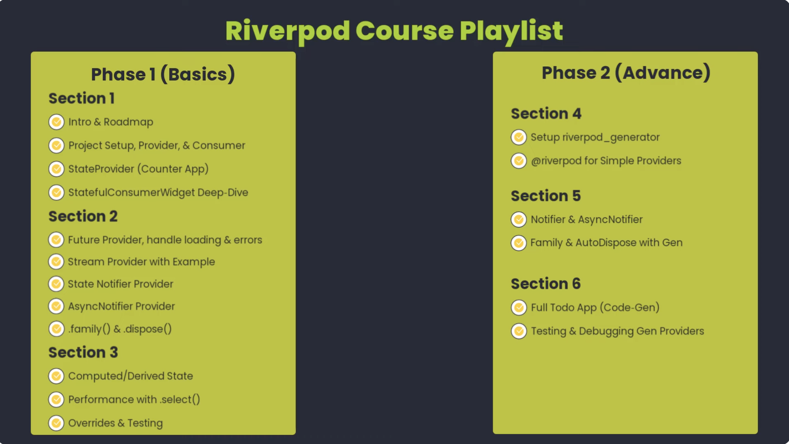
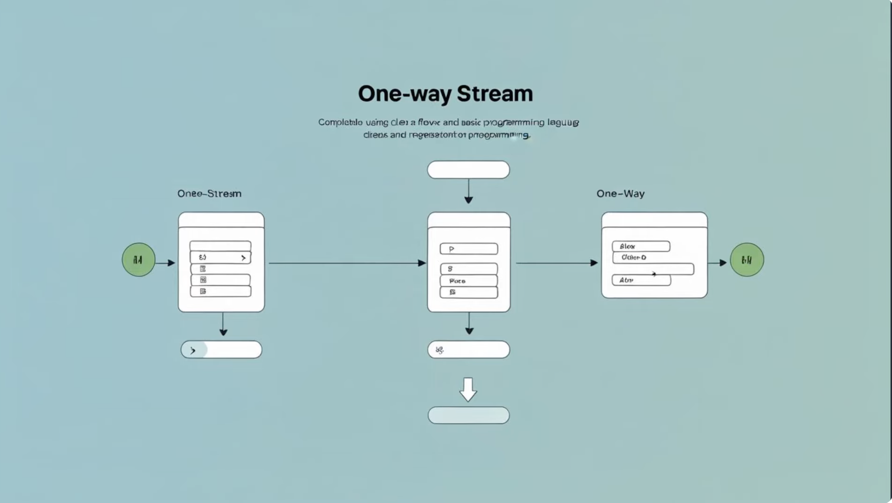

1. Video 01
    > Tired of chasing bugs when state changes?
<pre>
- why does this widget rebuild when i don't want it?
- How do I test my business login?
- How do I clean up resource when widgets unmount?
</pre>

# a. Why to use ProviderScope in runApp();

# b. Widget_tree

- Feature A: <mark> Controller is only register and available here... </mark>
- Feature B: Controller is not registered using Get.put :::: Result: Controller not found

# c. Riverpod Course Playlist

# ========= Riverpod =========
<pre>
- Don't have to worry about, if stream is create or not
- Most of the time streams are causing leagues
- If Streams not handled perfectly, it causes Data leaks
</pre>
# ============================
<pre>
+ Don't have to worry about creation
+ Don't have to worry about disposal
+ Everything will be managed Automatically
</pre>
# ========= One-way Stream =========

<pre>
- Riverpod handles things efficiently
- We can also do Testing Easily
- Riverpod Cache the last emitted value from the stream and display the value in user interface
</pre>