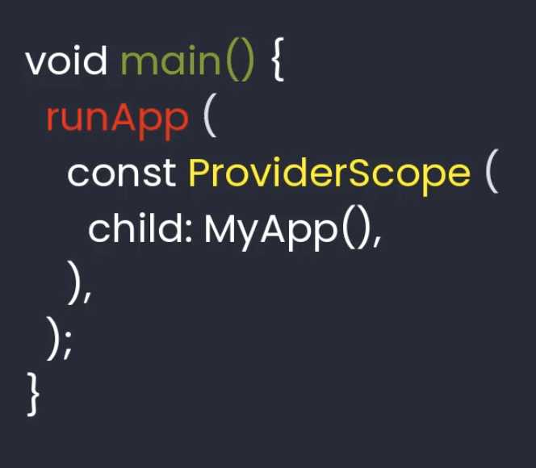
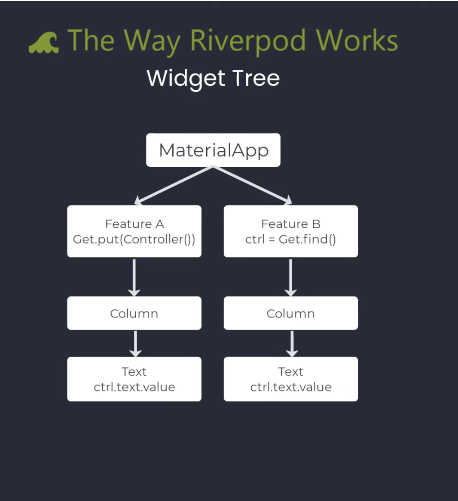
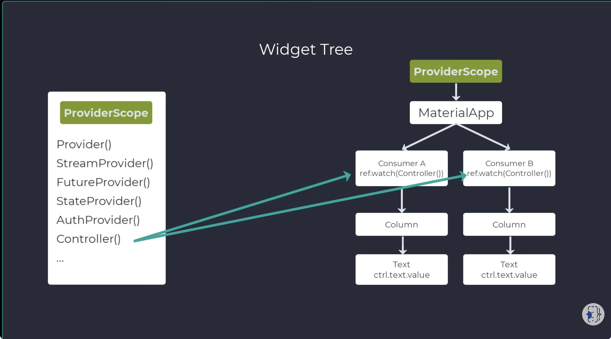

1. Video 01
    Tired of chasing bugs when state changes?
- why does this widget rebuild when i don't want it?
- How do I test my business login?
- How do I clean up resource when widgets unmount?

a. Why to use ProviderScope in runApp();

b. Widget_tree

- feature A: Controller is only register and available here...
- Feature B: Controller is not registered using Get.put :::: Result: Controller not found

