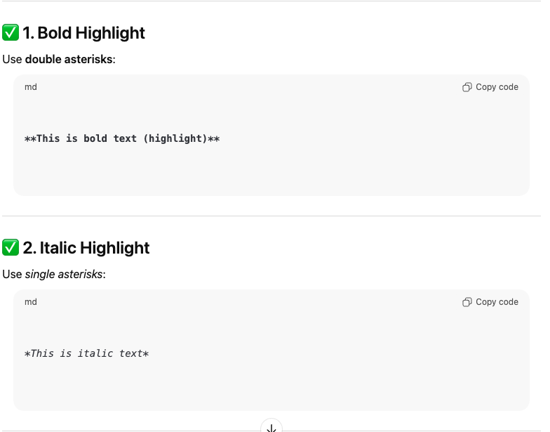
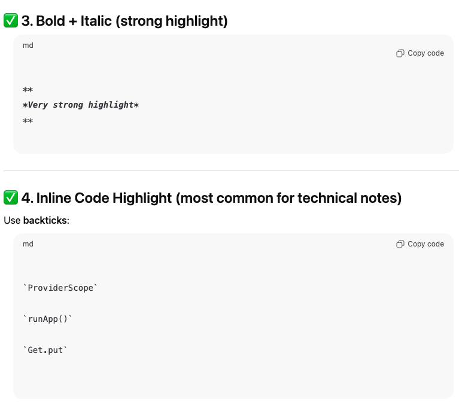
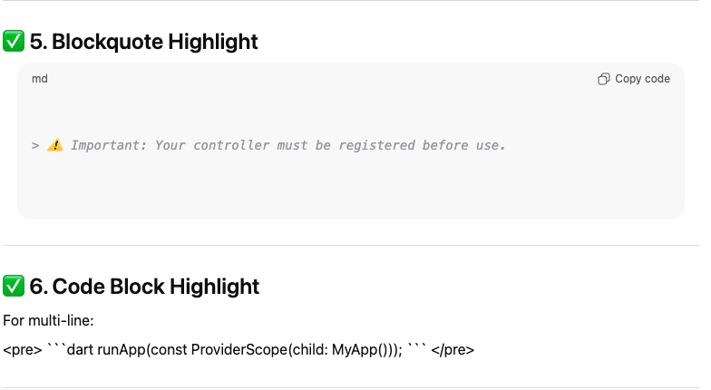
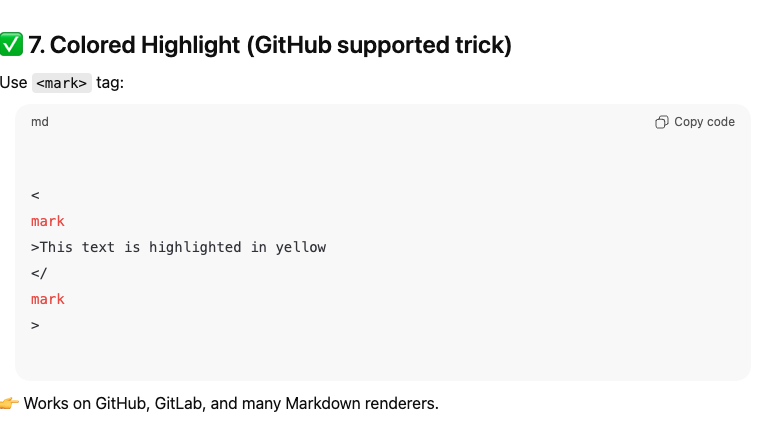

# 1. Bold Highlight
**This is bold text (highlight)**
# 2. Italic Highlight
*This is italic text*

 

# 3. Bold + Italic (strong highlight)
***Very strong highlight***
# 4. Inline Code Highlight (most common for technical notes)



# 5. Blockquote Highlight
> Important: Your controller must be registered before use.
# 6. Code Block Highlight
<pre> ```dart runApp(const ProviderScope(child: MyApp())); ``` </pre>



# 7. Colored Highlight (GitHub supported trick)

<mark>This text is highlighted in yellow</mark>
# ============ Example ==============
# a. Why use <mark>ProviderScope</mark> in `runApp()`?

**ProviderScope** is required because Riverpod needs a container
to manage providers automatically.
# ==================================




### 🔥 Why use Riverpod?
- <mark>No manual dispose()</mark>
- <mark>No memory leaks from Streams</mark>
- Cached values for performance
- Easy unit testing
